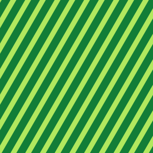
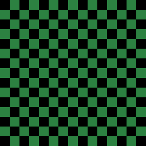

# Simple Background Generator

## Recommended Environment
This tool is designed for use on a PC with the Google Chrome browser. Operation on other devices or browsers is not guaranteed.

## 推奨環境
このツールは、PC上のGoogle Chromeブラウザでの使用を想定しています。他のデバイスやブラウザでの動作は保証されていません。

## Demo
You can try this tool on the page below.

https://black-sesame-ice-cream.github.io/simple-background-generator/

## デモ
以下のページでこのツールを試すことができます。

https://black-sesame-ice-cream.github.io/simple-background-generator/

## Overview
This is a web tool for generating simple background images.
It allows you to create and customize four different patterns, check them in a real-time preview, and download the result as a PNG file.

- Supported Patterns:
  - Solid Color
  - Gradient
  - Checkerboard
  - Stripes

## 概要
シンプルな背景画像を生成するためのWebツールです。
4種類の異なるパターンを作成・カスタマイズし、リアルタイムのプレビューで確認しながら、結果をPNGファイルとしてダウンロードできます。

- 対応パターン:
  - 単色
  - グラデーション
  - 市松模様
  - 縞模様

## Usage
1.  Set the desired **Dimensions** (Width and Height) in pixels.
2.  Select a **Pattern** type (Solid, Gradient, Checkerboard, or Stripes).
3.  Adjust the **Options** for the selected pattern (e.g., colors, size, angle).
4.  The preview will update automatically as you change the settings.
5.  Click the "Save as PNG" button to download the generated image.

## 使い方
1.  「寸法」で希望する幅 (Width) と高さ (Height) をピクセル単位で設定します。
2.  「パターン」で種類 (単色, グラデーション, 市松模様, 縞模様) を選択します。
3.  選択したパターンに応じて「オプション」を調整します (色、サイズ、角度など)。
4.  設定を変更すると、プレビューが自動的に更新されます。
5.  「PNGで保存」ボタンをクリックすると、生成された画像がダウンロードされます。

## Licenses
Please see below for details.

[License](LICENSE/)
[Third-Party Licenses](THIRD-PARTY-LICENSES.txt/)

## ライセンス
以下を参照してください。

[ライセンス](LICENSE/)
[第三者ライセンス](THIRD-PARTY-LICENSES.txt/)

## Tech Stack
This tool is built entirely with client-side technologies, requiring no frameworks or libraries.
-   HTML
-   CSS (Custom Properties, Flexbox)
-   JavaScript (Vanilla JS)
-   Canvas API
-   pako@2.1.0
-   upng-js@2.1.0